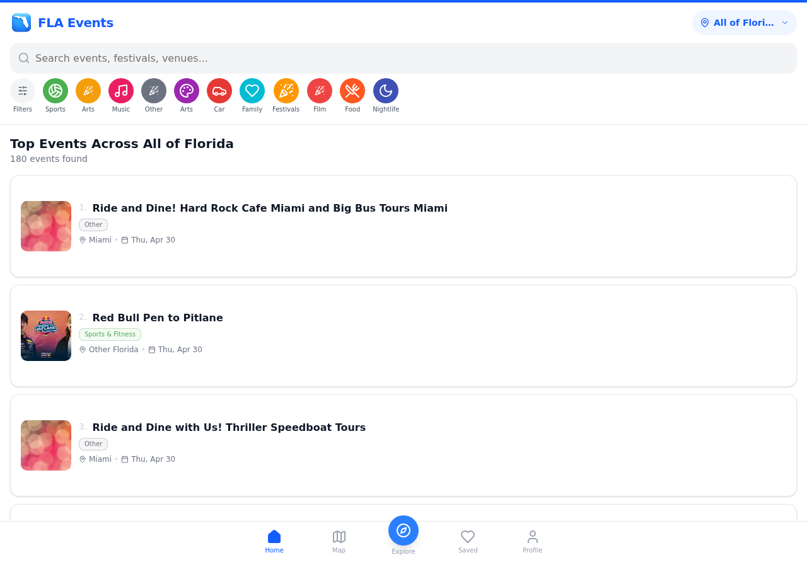
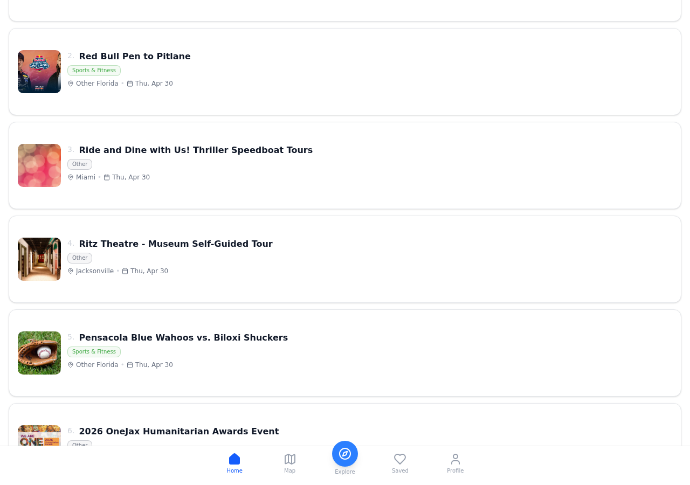
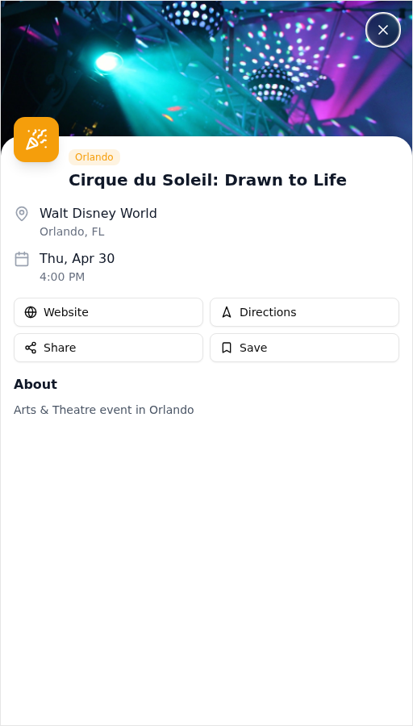

<p align="center">
  
  <h1 align="center">FLA Events</h1>
  <p align="center">
    <strong>Florida's Premier Event Discovery Platform</strong><br/>
    Discover concerts, festivals, sports, arts & more across the Sunshine State
  </p>
  <p align="center">
    
    
    
    
    
  </p>
</p>

---

## 🌴 What is FLA Events?

FLA Events is a modern, full-stack event discovery platform built for Florida. It aggregates events from across the state — concerts, sports, festivals, arts & theatre, food events, nightlife, and more — into one beautiful, fast, mobile-first experience.

Live at **[flaevents.com](https://www.flaevents.com)**

---

## ✨ Key Features

### 🔍 Smart Event Discovery
Browse **180+ events** across **7 regions** — Miami, Orlando, Tampa, Jacksonville, Fort Lauderdale, St. Petersburg, and beyond. Filter by category, region, date, and price.



### 🎯 Category Filtering
One-tap filters for Music, Sports, Arts, Food, Nightlife, Festivals, Film, Family events, and more.



### 📱 Mobile-First Design
Built mobile-first with a native app feel — smooth scrolling, swipe gestures, and responsive layouts.


### 🎭 Rich Event Details
Every event includes venue info, pricing, directions, share & save functionality, and direct ticket links.



### 🗺️ Interactive Map View
Explore events on an interactive map with cluster markers and region-based filtering.

### 💾 Save & Share
Bookmark your favorite events and share them directly to social media.

### 🤖 Automated Event Scraping
Events are automatically scraped and updated daily via Vercel Cron Jobs — no manual data entry.

### 💰 Sponsorship System
Built-in sponsorship platform for event organizers to promote their events.

### 🔐 Full Authentication
NextAuth.js integration with Google OAuth, magic links, and profile management.

---

## 🛠️ Tech Stack

| Layer | Technology |
|-------|-----------|
| **Framework** | Next.js 16 (App Router) |
| **Language** | TypeScript 5 |
| **Styling** | Tailwind CSS 4 + shadcn/ui |
| **Database** | PostgreSQL via Prisma ORM |
| **Auth** | NextAuth.js |
| **Maps** | Leaflet + Mapbox |
| **Animations** | Framer Motion |
| **State** | Zustand + TanStack Query |
| **Hosting** | Vercel |
| **Domain** | flaevents.com |

---

## 🚀 Getting Started

### Prerequisites
- Node.js 18+
- PostgreSQL database
- npm or bun

### Setup

```bash
# Clone the repo
git clone https://github.com/beckettech/FLA-events.git
cd FLA-events

# Install dependencies
npm install

# Set up environment variables
cp .env.example .env
# Edit .env with your DATABASE_URL, NEXTAUTH_SECRET, etc.

# Run database migrations
npx prisma db push

# Start dev server
npm run dev
```

Open [http://localhost:3000](http://localhost:3000)

---

## 📁 Project Structure

```
FLA-events/
├── src/
│   ├── app/              # Next.js App Router pages
│   │   ├── page.tsx      # Homepage (event discovery)
│   │   ├── events/       # Event detail pages
│   │   ├── admin/        # Admin dashboard
│   │   ├── api/          # API routes + cron jobs
│   │   ├── auth/         # Authentication pages
│   │   ├── profile/      # User profile
│   │   └── saved/        # Saved/bookmarked events
│   ├── components/       # React components
│   │   ├── map/          # MapView component
│   │   ├── SwipeCard.tsx # Tinder-style event cards
│   │   └── SponsoredBadge.tsx
│   ├── hooks/            # Custom React hooks
│   └── lib/              # Utilities + Prisma client
├── prisma/
│   └── schema.prisma     # Database schema
├── public/               # Static assets
└── scripts/              # Utility scripts
```

---

## 🌍 Regions Covered

| Region | Events |
|--------|--------|
| Miami | Concerts, nightlife, sports |
| Orlando | Theme parks, family events, arts |
| Tampa | Sports, music, festivals |
| Jacksonville | Theatre, comedy, community |
| Fort Lauderdale | Beach events, concerts |
| St. Petersburg | Arts, culture, dining |
| Statewide | Major tours, festivals |

---

## 📊 Scale

- **180+** live events at any time
- **7** Florida regions
- **10+** event categories
- Daily automated scraping & cleanup
- Sub-second page loads via Vercel Edge

---

## 📄 License

MIT License — see [LICENSE](LICENSE) for details.

---

## 👤 Author

**Beckett Hoefling**
- GitHub: [@beckettech](https://github.com/beckettech)
- Website: [bek-tech.com](https://www.bek-tech.com)

---

<p align="center">
  Built with ❤️ in Florida 🌴☀️
</p>
