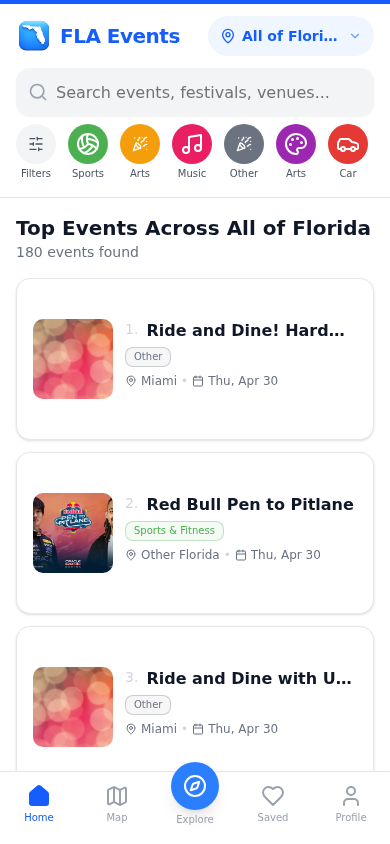
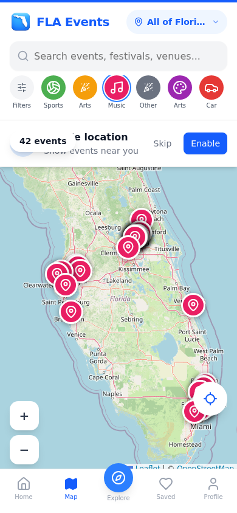
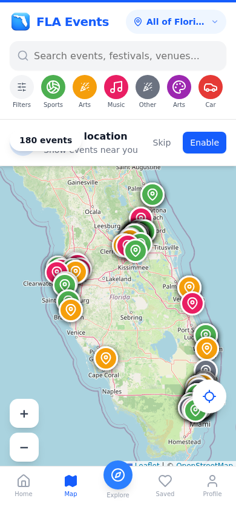
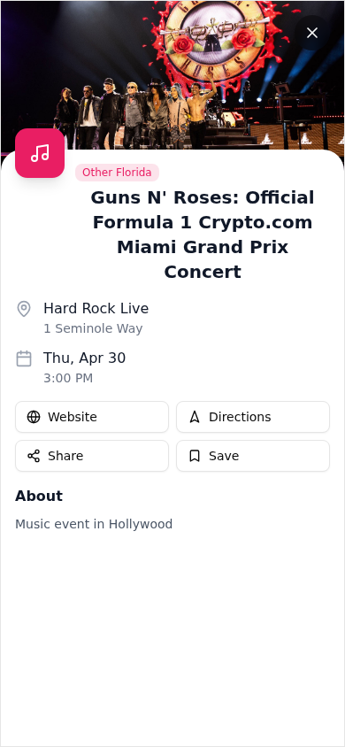
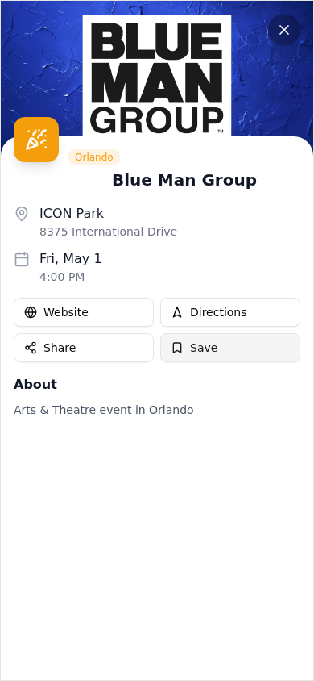
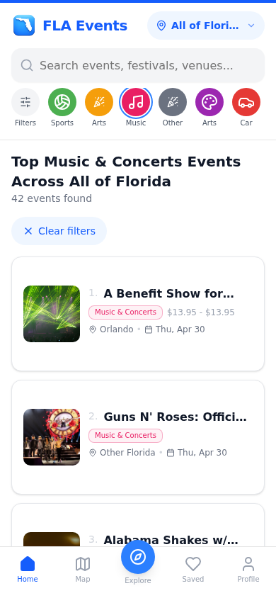

  
  <h1 align="center">FLA Events</h1>
  

    <strong>Florida's Premier Event Discovery Platform</strong> 
    Discover concerts, festivals, sports, arts & more across the Sunshine State
  

  

    
    
    
    
    
  

---

## 🌴 What is FLA Events?

FLA Events is a modern, full-stack event discovery platform built for Florida. It aggregates events from across the state — concerts, sports, festivals, arts & theatre, food events, nightlife, and more — into one beautiful, fast, mobile-first experience.

Live at **[flaevents.com](https://www.flaevents.com)**

---

## ✨ Features

### 🔍 Smart Event Discovery
Browse **180+ events** across Florida. Filter by category, region, date, and price.

  
  

### 🗺️ Interactive Map
Explore events on an interactive map — tap markers for details, filter by region.

  
  

### 🎭 Rich Event Details
Every event includes venue info, pricing, directions, share & save, and direct ticket links.

  
  

### 🎯 Category Filtering
One-tap filters for Music, Sports, Arts, Food, Nightlife, Festivals, Film, Family, and Car Shows.

### 📱 Mobile-First + Dark Mode
Built mobile-first with dark/light theme support, smooth scrolling, and swipe gestures.

### 🤖 Automated Event Scraping
Events are automatically scraped and updated daily via Vercel Cron Jobs — no manual data entry.

### 💰 Sponsorship System
Built-in sponsorship platform for event organizers to promote their events.

### 🔐 Full Authentication
NextAuth.js with Google OAuth, magic links, and profile management.

---

## 🛠️ Tech Stack

| Layer | Technology |
|-------|-----------|
| **Framework** | Next.js 16 (App Router) |
| **Language** | TypeScript 5 |
| **Styling** | Tailwind CSS 4 + shadcn/ui |
| **Database** | PostgreSQL via Prisma ORM |
| **Auth** | NextAuth.js |
| **Maps** | Leaflet |
| **Animations** | Framer Motion |
| **State** | Zustand + TanStack Query |
| **Hosting** | Vercel |

---

## 🌍 Regions

| Region | Coverage |
|--------|----------|
| **SoFlo** | Miami, Fort Lauderdale, West Palm Beach |
| **Central Florida** | Orlando, Daytona Beach, Space Coast |
| **Tampa Bay** | Tampa, St. Petersburg, Clearwater, Sarasota |
| **SWFL** | Naples, Fort Myers, Cape Coral |
| **North Florida** | Jacksonville, Gainesville, St. Augustine |
| **Panhandle** | Pensacola, Tallahassee, Panama City |

---

## 📊 Scale

- **180+** live events at any time
- **6** Florida regions
- **8** event categories
- Daily automated scraping & cleanup
- Sub-second page loads via Vercel Edge

---

## 📄 License

MIT License — see [LICENSE](LICENSE) for details.

---

## 👤 Author

**Beckett Hoefling**
- GitHub: [@beckettech](https://github.com/beckettech)
- Website: [bek-tech.com](https://www.bek-tech.com)

---

  Built with ❤️ in Florida 🌴☀️

